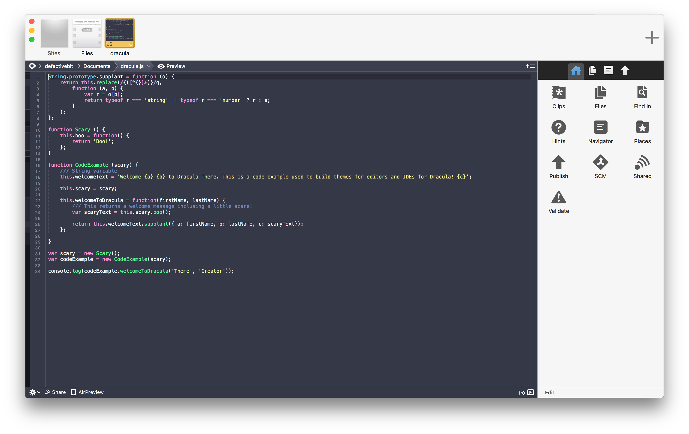

# Dracula for [Coda](http://panic.com/coda)

> A dark theme for [Coda](http://panic.com/coda).

## Install

All instructions can be found at [draculatheme.com/coda](https://draculatheme.com/coda).

## Team

This theme is maintained by the following person(s) and a bunch of [awesome contributors](https://github.com/dracula/coda/graphs/contributors).

 |
--- |
[Brian Tkatch](https://github.com/defectivebit) |

## License

[MIT License](./LICENSE)
